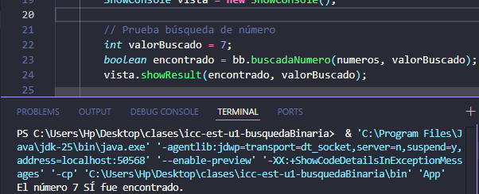
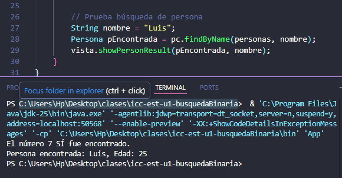

# Búsqueda Binaria -- MVC

**Estudiante:** Joshue Avecillas

## Práctica -- 17/nov

Implementación de búsqueda binaria y búsqueda de personas utilizando
arquitectura **MVC** en Java.

------------------------------------------------------------------------

## Componentes del Proyecto

### **Modelo**

-   `Persona`\
    Clase que representa a una persona con los atributos **nombre** y
    **edad**.

### **Controladores**

-   `BusquedaBinaria`\
    Implementa el algoritmo de búsqueda binaria para arreglos de enteros
    ordenados.

-   `PersonaController`\
    Permite buscar una persona por su nombre dentro de un arreglo de
    objetos `Persona`.

### **Vista**

-   `ShowConsole`\
    Muestra en consola los resultados de las búsquedas realizadas.

------------------------------------------------------------------------

## Ejecución del Programa

### **Búsqueda binaria de números**

Determina si un valor entero se encuentra dentro de un arreglo ordenado.

### **Búsqueda de personas por nombre**

Retorna e imprime los datos de la persona encontrada.\
Si no existe, muestra un mensaje indicándolo.

------------------------------------------------------------------------

## Estructura del Proyecto

    src/
     ├── model/
     │    └── Persona.java
     ├── controller/
     │    ├── BusquedaBinaria.java
     │    └── PersonaController.java
     ├── view/
     │    └── ShowConsole.java
     └── App.java

------------------------------------------------------------------------

## Ejemplo de Salida

### Resultado búsqueda binaria

### Resultado búsqueda de persona

------------------------------------------------------------------------

## Descripción General

Este proyecto demuestra cómo aplicar el patrón
**Modelo--Vista--Controlador** en una práctica sencilla de búsqueda de
datos.\
Incluye tanto lógica algorítmica (búsqueda binaria) como manejo de
objetos con Java.
